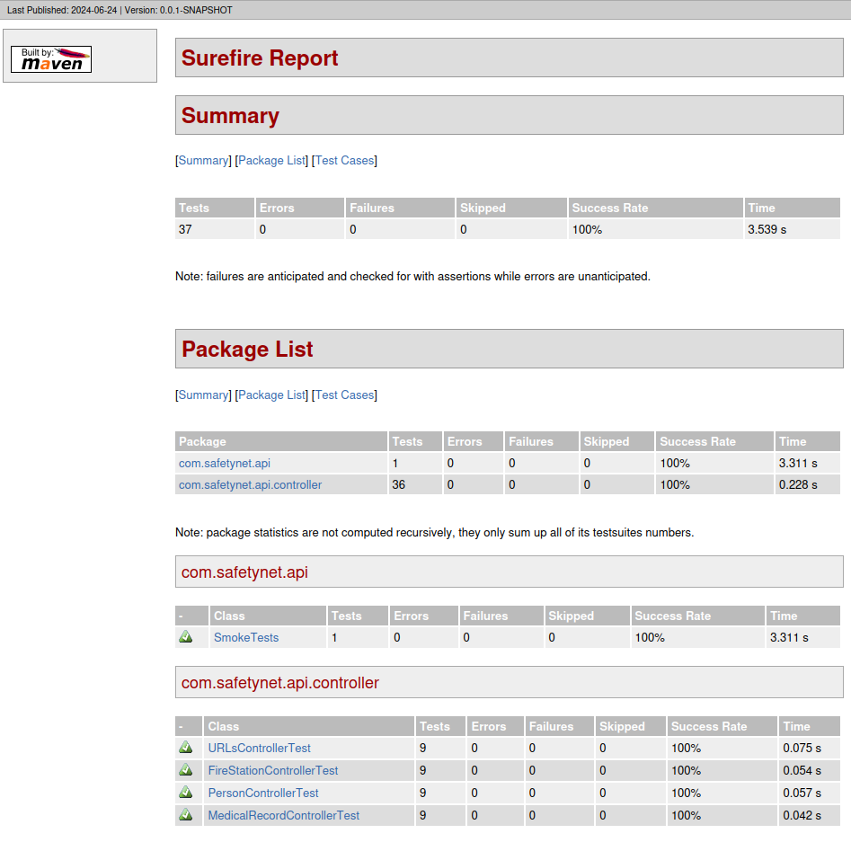
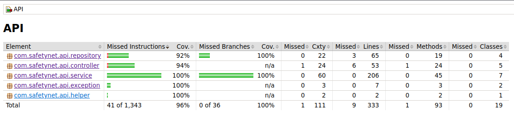
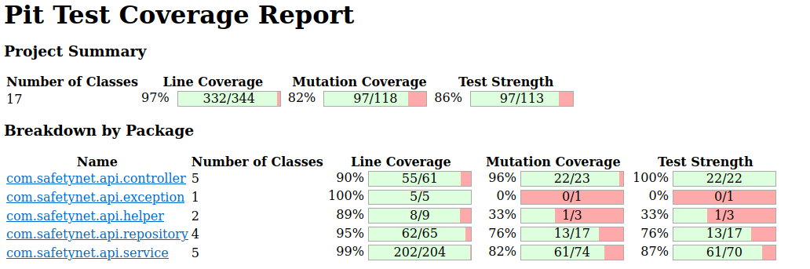

# Safetynet

## Building

There is 2 distinct way to build the application.

### Local

A Java runtime environment is needed for the program to run succesfully.
Please use your package manager to install one.

```shell
./mvnw install
chmod +x ./target/*.jar
./target/*.jar
```

Safetynet will start in the terminal session, and listen on the default port `8080` for any REST request.
This application was built and tested succesfully on Ubuntu 24.04 with OpenJDK-21.

### Container

A container can be spun up that will build and launch Safetynet.
The application will run on port `443`, but can be configured in the `docker/docker-compose.yml` file.

```shell
docker-compose up -d
```

The contaienr was tested on CI and with Podman.

## Request

### Child alerts

```shell
curl 'localhost:PORT/childAlert?address=1509%20Culver%20St' \
    -H 'Content-Type: application/json'
```

### Community e-mail

```shell
curl 'localhost:PORT/communityEmail?city=Culver' \
    -H 'Content-Type: application/json'
```

### List fire

```shell
curl 'localhost:PORT/fire?address=1509%20Culver%20St' \
    -H 'Content-Type: application/json'
```

### List flood

```shell
curl 'localhost:PORT/flood?stations=1%2C%202' \
    -H 'Content-Type: application/json'
```

### Person info

```shell
curl 'localhost:PORT/personInfo' \
    -H 'Content-Type: application/json'
```

### Phone alert

```shell
curl 'localhost:PORT/phoneAlert?firestation=1' \
    -H 'Content-Type: application/json'
```

### FireStation

```shell
curl 'localhost:PORT/fireStation?station=1' \
    -H 'Content-Type: application/json'
```

## Testing

To launch mutation test :
```shell
./mvnw test-compile org.pitest:pitest-maven:mutationCoverage 
```

### Test execution



### Coverage



### Mutation


